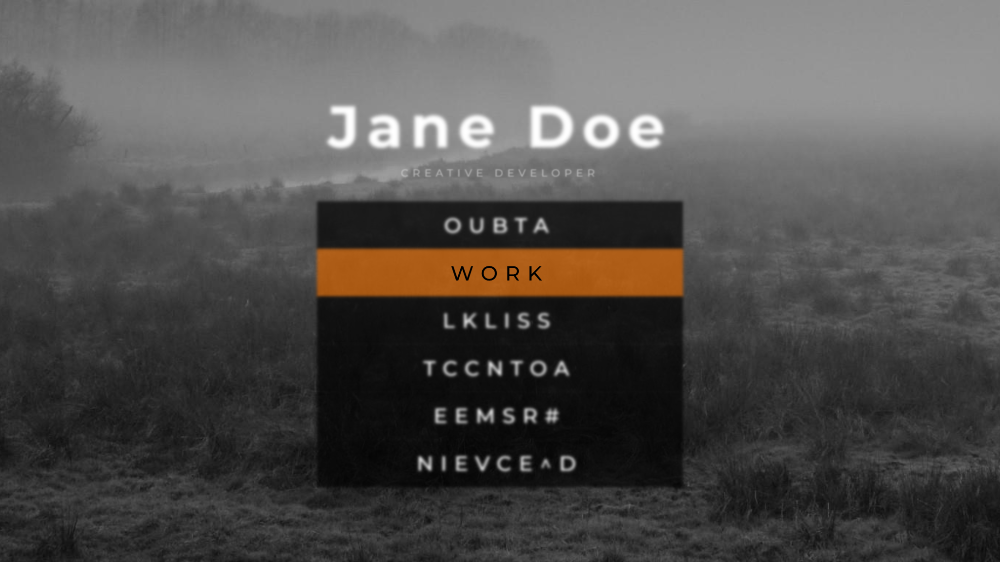
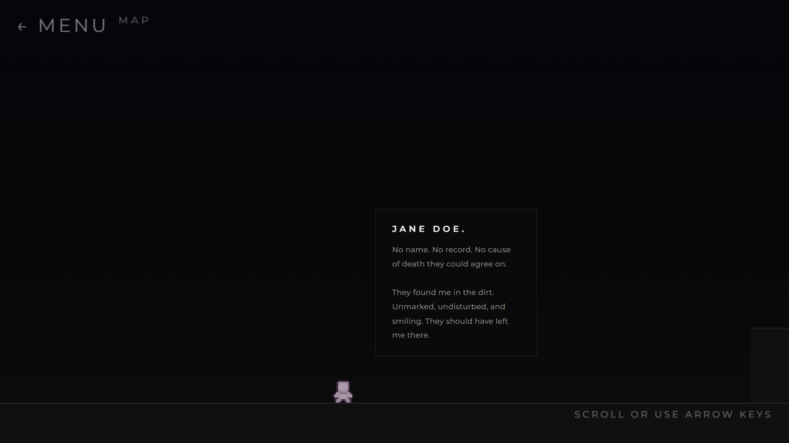
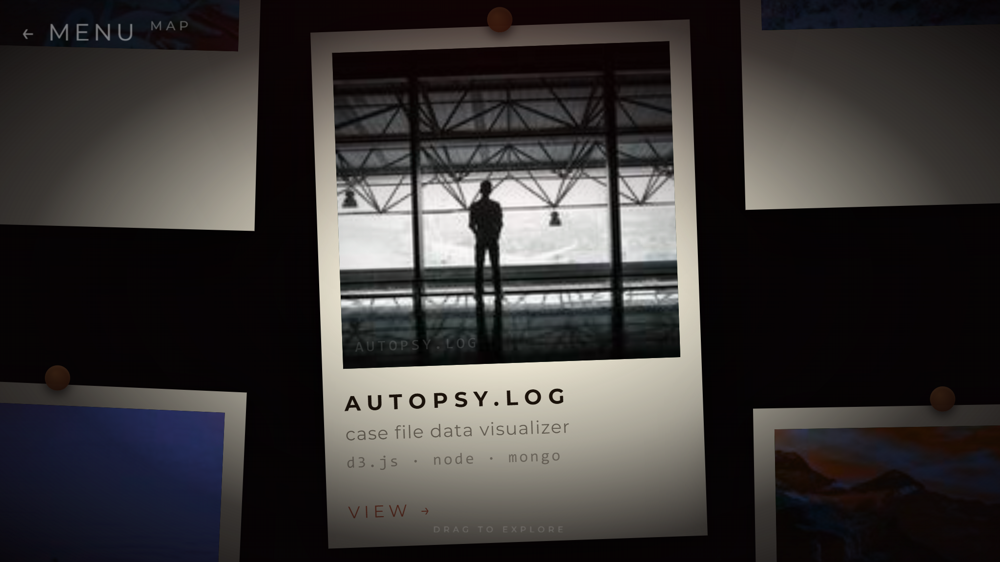
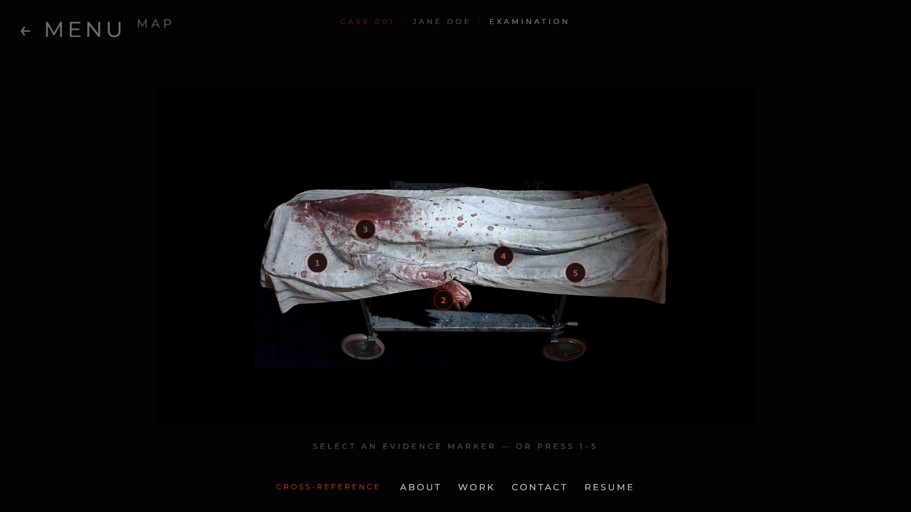
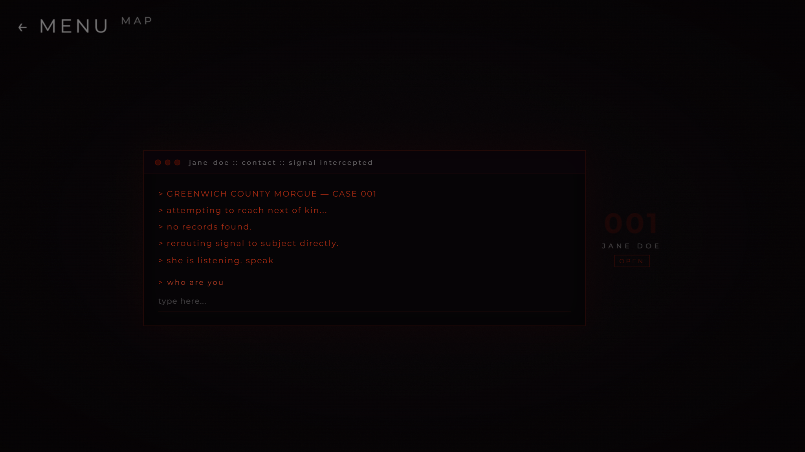
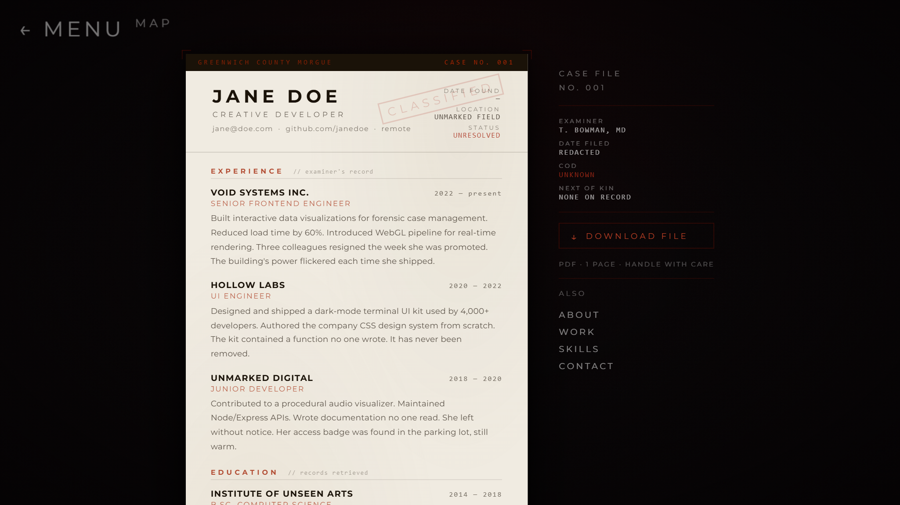
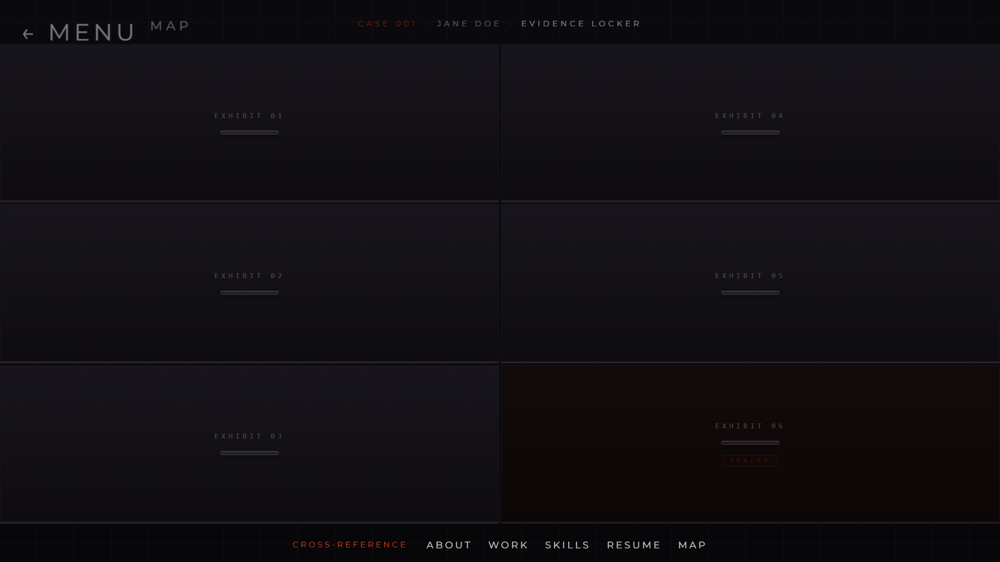
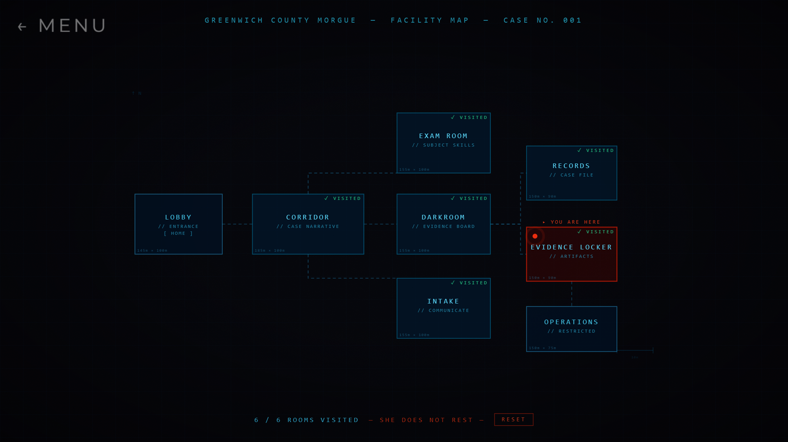

# Project Documentation

## The Autopsy of Jane Doe — An Interactive Horror Portfolio

**Author / Pembuat:** Joshua Manasye
**Project type:** Final Project — Web-Based App Development
**Live demo:** https://joshuamanasye.github.io/portfolio-of-jane-doe.github.io/
**Repository:** https://github.com/joshuamanasye/joshuamanasye.github.io

---

## 1. Website Description (Deskripsi Website)

**Concept (Konsep).**
*The Autopsy of Jane Doe* is a static personal-portfolio website that disguises
itself as a forensic case file. Rather than presenting "About / Work / Contact"
as ordinary scrolling sections, the site reimagines each of them as a **room
inside a morgue**. The visitor plays the role of an investigator exploring the
unexplained case of *Jane Doe*, a fictional creative developer. The aesthetic
and narrative are inspired by the horror film *The Autopsy of Jane Doe*.

**Purpose (Tujuan).**
To demonstrate clean, framework-free front-end engineering (HTML, CSS, vanilla
JS) while proving that a portfolio can be an *experience* rather than a document.
Each page showcases a different interaction technique — a game loop, a physics-y
drag world, dynamically generated SVG, audio, a typewriter terminal — so the
project doubles as a survey of what plain JavaScript can do.

**Target users (Target Pengguna).**
Recruiters, instructors, and fellow developers who want to gauge the author's
creativity and front-end skill — plus anyone who enjoys interactive, atmospheric
web experiences.

---

## 2. Main Features & Interactivity (Fitur Utama & Interaktivitas)

The site contains well beyond the required minimum of three interactive
features. Highlights per page:

1. **Animated game menu (`index.html`).** A keyboard/mouse-driven main menu
   styled like a video-game title screen. Unselected items continuously
   *glitch-scramble* their letters; the selected item resolves to a readable
   label. Includes a parallax background, background music, and button/select
   sound effects (gated behind a "click to enter" screen to satisfy browser
   autoplay rules).

2. **Side-scrolling platformer (`about.html`).** The bio is laid out across a
   wide world that the visitor walks through. A sprite character follows the
   camera with a walking animation (mirrored by direction), the scroll
   **snaps to bio panels**, the terrain follows a hand-authored elevation path,
   and the level ends in a row of **doors** leading to other rooms. A hidden
   **jump-scare** triggers partway through.

3. **Drag-to-explore darkroom (`work.html`).** Projects are pinned as Polaroid
   photos on a 2-D board you pan by dragging. Photos start undeveloped (dark) and
   **"develop" into color** as they approach the center of the screen
   (a proximity-based CSS brightness filter). Clicking a photo opens a project
   modal.

4. **Autopsy examination table (`skills.html`).** Skills are presented as an
   autopsy. Clicking any of five **evidence pins** (or pressing `1`–`5`) zooms
   the camera into that part of the body and slides in a "finding" card listing
   the relevant skills.

5. **Retro terminal contact form (`contact.html`).** A CRT-style terminal types
   out an intro, then reveals the contact form one field at a time. Submitting
   produces an in-character "reply" — followed by a jump-scare.

6. **Forensic case-file résumé (`resume.html`).** The résumé is formatted as a
   coroner's report, complete with rubber stamps and a **cycling "cause of
   death"** field, plus a download button.

7. **Evidence locker (`evidence.html`).** Achievements live in a grid of steel
   drawers; clicking one **slides it open** to reveal the artifact inside (only
   one open at a time). One drawer is permanently **SEALED**.

8. **Interactive facility map (`map.html`).** A blueprint floor-plan **generated
   at runtime as SVG**. It reads `localStorage` to mark which rooms you've
   visited, draws a pulsing **"you are here"** indicator on the last room you
   left, shows a progress counter, and offers a **reset** button.

**Cross-page progress system.** Every room writes a `visited_*` flag and a
`last_room` value to `localStorage`. The map reflects this state, turning the
otherwise-separate pages into one connected, persistent "investigation."

---

## 3. Folder Structure & Code Notes (Struktur Folder & Penjelasan Kode)

```
portfolio-of-jane-doe.github.io/
├── index.html              Main menu — the "entrance"
├── about.html              Side-scrolling platformer (bio)
├── work.html               Darkroom — project photos
├── skills.html             Examination table — skills
├── contact.html            Terminal — contact form
├── resume.html             Case-file résumé
├── evidence.html           Evidence locker — achievements
├── map.html                Facility floor-plan map
│
├── main.css                Shared styles: back/map nav buttons, loader
├── index.css               Per-page stylesheets …
├── about.css  work.css  skills.css  contact.css
├── resume.css  evidence.css  map.css
│
├── js/
│   ├── index.js            Menu navigation, glitch text, audio, parallax
│   ├── about.js            Platformer engine (RAF loop, camera, sprite, doors)
│   ├── work.js             Drag-pan world + proximity "develop" + modal
│   ├── skills.js           Evidence-pin zoom + finding cards
│   ├── contact.js          Terminal typewriter + staged form + jump-scare
│   ├── resume.js           Cause-of-death cycler
│   ├── evidence.js         Drawer open/close logic
│   └── map.js              Runtime SVG floor-plan + localStorage progress
│
├── assets/                 Sprites, background, body image, audio (sfx/bgm)
├── docs/                   This documentation + screenshots
├── _config.yml             GitHub Pages (Jekyll) configuration
└── README.md
```

**Code organisation notes.**
- Technologies are kept in **separate files** (HTML / CSS / JS) as required;
  there is no inline scripting or styling of significance.
- Styling shared by every page (the `← menu` / `map` nav buttons and the
  loading screen) lives once in `main.css`; everything page-specific lives in
  that page's own stylesheet.
- All JavaScript is **vanilla ES6** — no build step, no dependencies. The most
  involved module is `about.js`, which runs a `requestAnimationFrame` loop with
  a camera that the character lerps toward (capped to a max speed) and an
  elevation path interpolated with smoothstep. `map.js` is notable for building
  its entire SVG via `document.createElementNS`.
- Responsiveness uses CSS `clamp()` for fluid type/sizing and `@media` queries
  for mobile layout adjustments.

---

## 4. Technologies Used (Teknologi yang Digunakan)

| Technology | Used for |
|------------|----------|
| **HTML5** | 8 semantic, separate pages |
| **CSS3** | Layout (fl/grid), animations & transitions, `clamp()` responsive sizing, blueprint/grain/vignette overlays, SVG styling |
| **JavaScript (ES6, vanilla)** | Game loop (`requestAnimationFrame`), runtime **SVG** generation, **Web Audio** (BGM + SFX), event handling, the **`localStorage`** cross-page progress system |
| **SVG** | The interactive facility map (generated dynamically) |
| **GitHub Pages + Jekyll** | Static hosting (`_config.yml`) |

No external JS frameworks or libraries are used. Image/audio assets are either
sprite packs with permissive licenses or placeholder imagery.

---

## 5. Sitemap

```
                         index.html  (Main Menu / Entrance)
                                │
   ┌──────────┬──────────┬──────┼───────┬───────────┬───────────┐
   ▼          ▼          ▼              ▼           ▼           ▼
about.html  work.html  skills.html  contact.html  resume.html  evidence.html
(Corridor) (Darkroom)  (Exam Room)   (Intake)     (Records)    (Evidence Locker)
   │          │          │              │           │           │
   └──────────┴──────────┴──────┬───────┴───────────┴───────────┘
                                ▼
                          map.html  (Facility Map)
        (links to every room; reflects visited progress via localStorage)
```

Every room also contains a `← menu` link (back to `index.html`) and a `map`
link, and the content rooms cross-reference each other directly.

---

## 6. Screenshots (Screenshot Tampilan Website)

> Full-resolution images are in [`docs/screenshots/`](screenshots/).

### Main Menu — `index.html`


### About — side-scrolling platformer (`about.html`)


### Work — darkroom of project photos (`work.html`)


### Skills — autopsy examination table (`skills.html`)


### Contact — terminal (`contact.html`)


### Résumé — forensic case file (`resume.html`)


### Evidence Locker — achievements (`evidence.html`)


### Facility Map — visited-room tracking (`map.html`)


---

## 7. Demo Link

**Live site:** https://joshuamanasye.github.io/portfolio-of-jane-doe.github.io/

To run locally, serve the project folder with any static server
(e.g. `python -m http.server 8000`) and open the printed address.
